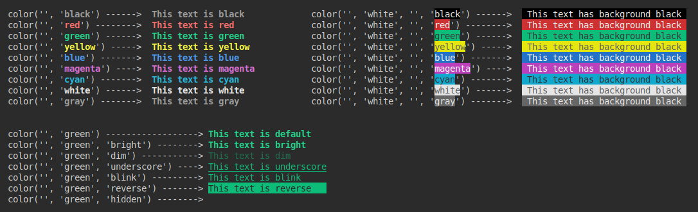

# jb-node-lib

This **node.js** library contains a set of common utility functions to build NodeJs apps.

## Instalation
The library is published on NPM, so you can easily install it with → `npm install jb-node-lib`<br/>

The library is written as a CommonJS module, so it can be imported as a **CommonJS** or **ECMAScript** Module.

### ECMAScript
```javascript
import { init, exit, cmd, sleep, dirExist, formatTime, formatSize } from 'jb-node-lib';
import { move, print, line, repeat, color, setColor, resetColor, printBox } from 'jb-node-lib';
import { red, green, yellow, blue, gray, grayDark, cyan, black, brown, white } from 'jb-node-lib';

// Remember to add "type": "module", in package.json to use ES modules

init();
print(yellow('Hello World!'), 10, 2);
exit();
```

### CommonJS
```javascript
const { init, exit, cmd, sleep, dirExist, formatTime, formatSize } = require('jb-node-lib');
const { move, print, line, repeat, color, setColor, resetColor, printBox } = require('jb-node-lib');
const { red, green, yellow, blue, gray, grayDark, cyan, black, brown, white } = require('jb-node-lib');

init();
print(yellow('Hello World!'), 10, 2);
exit();
```

## Initialization

You can simply init everything calling `init();`

Most of the character printing is done through the `process.stdout.write()` api.
The cursor is moved to any position on the terminal using `readline.cursorTo(process.stdout, x, y)`.
For this reason the library imports and uses the native resources internally.
```javascript
const { exec } = require('child_process');
const readline = require('readline');
```
If you want to use the keyboard to handle key strike events (like arrows), the `init()` function will set the `readline` and `process.stdin`:
```javascript
readline.emitKeypressEvents(process.stdin);
if (process.stdin.setRawMode != null) { process.stdin.setRawMode(true); }
```
So you cand simply listen to the event:
```javascript
init();
process.stdin.on('keypress', (str, key) => {
  if (key.name === 'c' && key.ctrl) { exit(); } // Ctrl+C stop signal
  if (key.name === 'up')     { doSomething(); }
  if (key.name === 'down')   { doSomething(); }
  if (key.name === 'return') { doSomething(); }
  if (key.name === 'space')  { doSomething(); }
  if (key.name === 'escape') { doSomething(); }
});
```


## List of Functions
The library exports functions of different purposes, although it focuses on printing elements on a terminal.

- [`init()`](#init)       → It initializes the readline and process stdin for keyboard event handling.
- `exit`       → Terminates the process (`process.exit(0)`) and moves the cursor to the last line.
- `cmd`        → Use it to run a terminal command within the app.
- `sleep`      → Async function to await N milliseconds.
- `move`       → Move the cursor to a given position in the terminal.
- `print`      → Prints a string to a given position in the terminal.
- `line`       → Prints 1 or more strings on different positions of the same line.
- `repeat`     → It returns a string repeating the given char N times.
- `color`      → It returns the same string but wrapped with the control chars to print it colored.
- `setColor`   → It prints a color control char, so every print after is done in that color.
- `resetColor` → Resets the current color to the default (after a setColor).
- `printBox`   → It prints a line box to the given position, with additional colomns inside.
- `red`        → Color Fn. Turns your text red.
- `green`      → Color Fn. Turns your text green.
- `yellow`     → Color Fn. Turns your text yellow.
- `blue`       → Color Fn. Turns your text blue.
- `gray`       → Color Fn. Turns your text gray.
- `grayDark`   → Color Fn. Turns your text grayDark.
- `cyan`       → Color Fn. Turns your text cyan.
- `black`      → Color Fn. Turns your text black.
- `brown`      → Color Fn. Turns your text brown.
- `white`      → Color Fn. Turns your text white.
- `dirExist`   → Validates whether a directory exists (true) or not (false).
- `pad`        → A shortcut for `.padStart()` left padding.
- `formatTime` → It returns a string with a formated time.
- `formatSize` → It returns a string with a formated file size (KB, MB, GB...)


### init()
```javascript
function init(clear = true): void

// Example:
init();
```
This function initializes the readline and process.stdin so you can use the keyboard to handle key strike events.<br/>
It also clears all the characters on the terminal by default. You can opt out passing the `clear = false` parameter.


### exit()
```javascript
function exit(clear = false): void

// Example:
exit();
```
This function terminates the process with `process.exit(0)` and moves the cursor to the last line.
It doesn't clears all the characters on the terminal by default, but you can pass `clear = true` to do it.


### cmd()        
```javascript
function cmd(command: string): Promise<stdout>

// Example:
await cmd(`rm -rf ${file.path}`);
```
Use it to run a terminal command within the app.
It uses the `exec` api to run the command, so it returns a promise when that is completed/error.


### sleep()      
```javascript
function sleep(ms: number): Promise<void>

// Example:
await sleep(3000);
```
Async function to await N milliseconds.


### move()       
```javascript
function move(x = 1, y = 1): void

// Example:
move(30, 5);
```
Move the cursor to a given position in the terminal.


### print()      
```javascript
function print(text?: string, x: number, y: number, color: string): void

// Example:
print('Hello World!', 10, 3, 'yellow');
```
Prints the string `text` to a given position `x, y` in the terminal.<br/>
You can also add a `color` (See [colors palette](#color-palette)).


### line()
```javascript
function line([..., strN: string, posN: number]): void

// Example:
line('Player1: 00   Player2: 00   Player3: 00', 0);
line('99', 10, '99', 24, '99', 38); // It only prints the values
```
Prints multiple strings onto the same line, in different positions.<br/>
`args` should be pairs of strings and numbers, like: line('hello', 3, 'bye', 15, 'end', 50);


### repeat()
```javascript
function repeat(num: number, char: string): string

// Example:
repeat(10, '-'); // Returns: ----------
```
Returns a string with 'char' repeated 'num' times


### color()
```javascript
function color(text: string, color = 'green', effect = 'bright', bgColor = ''): string

// Example:
print(color('This text is green', 'green'), 1, 1);
print(color('This text is green bg blinking text', 'white', 'blink', 'green'), 1, 2);
```
It returns the same string but wrapped with the control chars to print it colored.
- 1st argument → Text color 
- 2nd argument → Text effect 
- 3rd argument → Text background

Colors: `black`, `red`, `green`, `yellow`, `blue`, `magenta`, `cyan`, `white`, `gray`
Effects: `bright`, `dim`, `underscore`, `blink`, `reverse`, `hidden`

See [colors palette](#color-palette) for more.


### setColor()
```javascript
function setColor(color = 'green', effect = 'bright', bgColor = ''): string

// Example:
setColor('green');  // Returns `\x1b[32m`
print('This text is green');
resetColor();       // Returns `\x1b[0m`
print('This text is white default');
```
It prints a color control char, so every print after is done in that color.<br/>
See [colors palette](#color-palette) for more.


### resetColor() 
```javascript
function resetColor(): void

// Example:
setColor('green');  // Returns `\x1b[32m`
print('This text is green');
resetColor();       // Returns `\x1b[0m`
print('This text is white default');
```
Resets the current color to the default (after a `setColor()`).<br/>
See [colors palette](#color-palette) for more.


### printBox()   
```javascript
function printBox(posX = 0, posY = 0, width = 80, height = 20, cols = []): void;

// Example:
printBox(1, 1, 30, 7, [7, 15]);   
// ┌──────┬───────┬───────────────┐
// │      │       │               │
// │      │       │               │
// └──────┴───────┴───────────────┘
// 1      7       15             31
```
It prints a line box to the given position, with additional colomns inside.


### dirExist()
```javascript
function dirExist(fullPath: string): boolean;

// Example:
dirExist(`/home/barba/testDir`);
```
Validates whether a directory exists (true) or not (false).
It uses `try`/`catch`, so it can be expensive in terms of performance (use it accordingly).


### pad() 
```javascript
function pad(text: string, size = 1, char = '0'): string;

// Example:
pad(25, 4, '0'); // = 0025
```
A shortcut for left padding `.padStart()`.


### formatTime() 
```javascript
function formatTime(ms: number): string;

// Example:
formatTime();
```
It returns a string with a formated time.


### formatSize() 
```javascript
function xxxxx(): void;

// Example:
xxxxx();
```
It returns a string with a formated file size (KB, MB, GB...)


## Color Palette
There is a palette of 9 different colors you can use to print text:
```javascript
print(color('This text is black',   'black'),   1, 1);
print(color('This text is red',     'red'),     1, 2);
print(color('This text is green',   'green'),   1, 3);
print(color('This text is yellow',  'yellow'),  1, 4);
print(color('This text is blue',    'blue'),    1, 5);
print(color('This text is magenta', 'magenta'), 1, 6);
print(color('This text is cyan',    'cyan'),    1, 7);
print(color('This text is white',   'white'),   1, 8);
print(color('This text is gray',    'gray'),    1, 9);
```




You can also use **background** colors, and 6 different effects:
- bright (default)
- dim
- underscore
- blink
- reverse
- hidden


### red()        
Color Fn. Turns your text red.

### green()      
Color Fn. Turns your text green.

### yellow()     
Color Fn. Turns your text yellow.

### blue()       
Color Fn. Turns your text blue.

### gray()       
Color Fn. Turns your text gray.

### grayDark()   
Color Fn. Turns your text grayDark.

### cyan()       
Color Fn. Turns your text cyan.

### black()      
Color Fn. Turns your text black.

### brown()      
Color Fn. Turns your text brown.

### white()      
Color Fn. Turns your text white.


## Further help
You can leave some comments on the project or contact [me](mailto:joel.barba.vidal@gmail.com) directly for more information.
